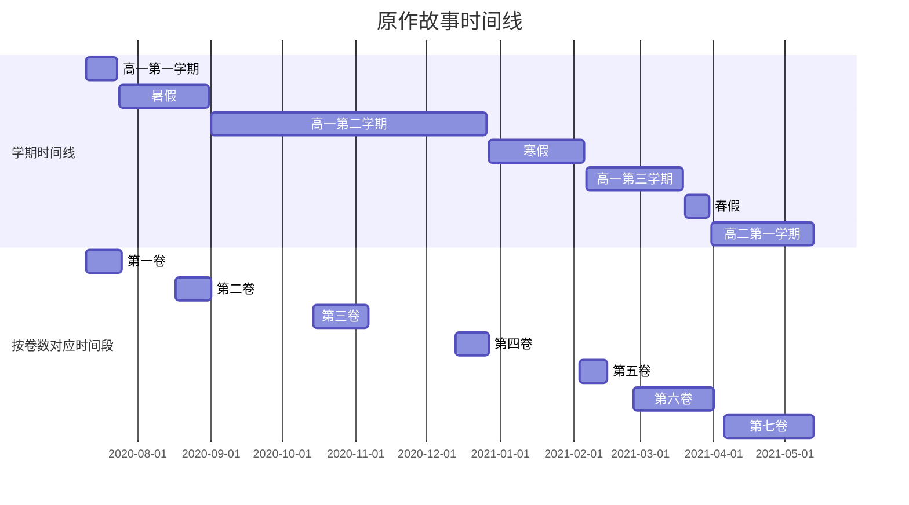

# 时间线

年份锚定：

五卷开头的“下周星期日——2月14日，情人节。”和四卷特典 四舍五入的年纪开头的“11月底，星期日的午后。”对应八奈见生日11月29日，都可以直接印证原作时间线开始于2020年。

故事大致时间线：

```mermaid 
gantt 
title 原作故事时间线
dateFormat  YYYY-MM-DD

section 学期时间线
高一第一学期:semester1, 2020-07-10, 2020-07-23
暑假:semester2,2020-07-24, 2020-08-31
高一第二学期:semester3, 2020-09-01, 2020-12-26
寒假:semester4, 2020-12-27, 2021-02-05
高一第三学期: semester5, 2021-02-06, 2021-03-19
春假: semester6, 2021-03-20, 2021-03-30
高二第一学期: semester7, 2021-03-31, 2021-05-13

section 按卷数对应时间段
第一卷:volume1, 2020-07-10, 2020-07-25
第二卷:volume2, 2020-08-17, 2020-09-01
第三卷:volume3, 2020-10-14, 2020-11-06
第四卷:volume4, 2020-12-13, 2020-12-27
第五卷:volume5, 2021-02-03, 2021-02-15
第六卷:volume6, 2021-02-26, 2021-04-01
第七卷:volume7, 2021-04-05, 2021-05-13
```